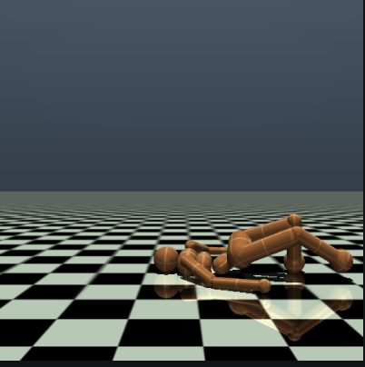
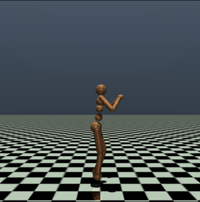

# RLMujoco

<p align="center">
 
  
  
  
</p>

## Project Overview
This project focuses on applying reinforcement learning (RL) techniques to train agents within various MuJoCo sub-environments (Ant-v4, Humanoid-v4, HumanoidStandup-v4, HalfCheetah-v4) as part of the coursework for RL for AI. MuJoCo, a physics engine, provides a realistic simulation for agent interaction and learning.


## Objectives of the Project:

1) Train agents in diverse and complex environments using MuJoCo.
2) Utilize the Gymnasium interface for rendering the training environments.
3) Explore the capabilities of advanced RL algorithms such as Proximal Policy Optimization (PPO), Soft Actor Critic (SAC) , Advantage Actor Critic (A2C), Deep Q Network (DQN) etc.
4) Exploit hyper-parameters such as learning rate and discount factor through tuning to obtain optimized model.
5) Manipulate reward calculation in sub env.


## Getting Started
### Prerequisites
Ensure you have the following installed:

 1) python - v3.11.1 (recommended 3.7 or higher)
 
 2) Gymnasium - v0.29.1

    `pip install gymnasium[mujoco]`

  --  More details : [Gymnasium-mujoco](https://gymnasium.farama.org/environments/mujoco/)


 3) stable-baselines3 - v2.2.1
    
    `pip install stable-baselines3[extra]`

 -- More details : [stable-baselines3](https://stable-baselines3.readthedocs.io/en/master/guide/install.html)


 ### Environment Setup
1. **Clone the Repository:**

`git clone https://github.com/Jitu0110/RLMujoco.git`

`cd RLMujoco/Code`


## Usage

This section provides detailed instructions on how to train the reinforcement learning (RL) agents in the MuJoCo environments, adjust training parameters, and evaluate the training outcomes.

### 1) Training the Agents
- **Start Training:**
  - To begin training an agent, use the following command:
    ```bash
    python main.py [EnvironmentName] [AlgorithmName] -t
    ```
  - Replace `[EnvironmentName]` with the name of the MuJoCo environment you wish to use, and `[AlgorithmName]` with the RL algorithm you're implementing.
  - Example :  `python3 main.py Humanoid-v4 SAC -t`
 
- **Algorithm Execution Guide**

  Below is a table outlining different algorithms and the corresponding command to run each one. This will help you quickly start 
  experiments with various reinforcement learning methods.

  | Algorithm | Command                         |
  |-----------|-----------------------------------------------|
  | SAC       | `python main.py Humanoid-v4 SAC -t`          |
  | A2C       | `python main.py Humanoid-v4 A2C -t`          |
  | DQN       | `python main.py Humanoid-v4 DQN -t`          |
  | PPO       | `python main.py Humanoid-v4 PPO -t`          |

  - Replace `Humanoid-v4` with the environment you wish to use if different.


- **Monitor Training:**
  - You can monitor the training process in real-time using TensorBoard.
    ```bash
    tensorboard --logdir [LogFolder]

    ```


### 2) Adjusting Parameters
- **Modifying Hyperparameters:**
  - You can modify the learning rate, discount factor etc by updating the train function in main.py. Check default values before updating.
    Example :
    
        model = SAC('MlpPolicy', env, verbose=1, device='cpu', tensorboard_log=log_dir,learning_rate=0.01)

- **Modifying Rewards:**
  - Check where the mujoco package files have beein installed on your device. For me, it is at this location : /opt/homebrew/lib/python3.11/site-packages/gymnasium/envs/mujoco
  -  Modify the code of the required env file from here.
  -  NOTE: I have modified the Humanoid-v4.py to make the agent move faster in the forward direction by manipulating the reward calculation. The file is available in the 'Code' directory.


### 3) Testing
  - To begin testing an agent using the model created, use the following command:
    ```bash
    python main.py [EnvironmentName] [AlgorithmName] -s [PathToModel]
    ```
  - Replace `[EnvironmentName]` with the name of the MuJoCo environment you wish to use, and `[AlgorithmName]` with the RL algorithm you're implementing.
  - Replace `[PathToModel]` with the path to the NeuralNetwork Model created in the training step.
  - Example :  `python3 main.py Humanoid-v4 SAC -s /Users/xyz/models_Humanoid/SAC_1100000.zip`
  - NOTE : The Model and Log directory can be updated by changing the model_dir and log_dir variables in main.py before training.


## Results

### Humanoid-v4
 - Algorithm : SAC
 - Timesteps : 1100000
 - Rewards modified : `healthy_reward=15.0, forward_reward*=2.5 , ctrl_cost*=0.5`
 - Final Training Stage
   
https://github.com/Jitu0110/RLMujoco/assets/53211153/c0038a17-e229-4ca5-a0f7-c4d64ae169c7


### HalfCheetah-v4

 - Algorithm : PPO
 - Timesteps : 200000
 - Mid Training Stage

https://github.com/Jitu0110/RLMujoco/assets/53211153/f9ca988e-edce-4e82-b4ed-e15b09af361b


 - Algorithm : PPO
 - Timesteps : 725000
 - Final Training Stage
   
https://github.com/Jitu0110/RLMujoco/assets/53211153/91754329-89a9-4b58-9a5d-fe13d2b6fd3e


### Ant-v4

 - Algorithm : PPO
 - Timesteps : 550000
 - Final Training Stage

https://github.com/Jitu0110/RLMujoco/assets/53211153/0e75be17-4b24-4741-bb5a-2a264e74fd67


 
 
 
 


